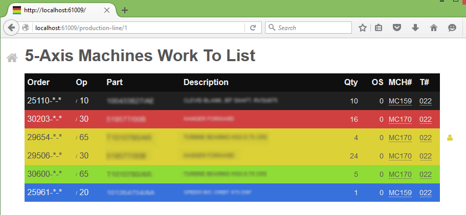

# Drum Buffer Rope Work To Lists

Web service that displays our Drum Buffer Rope prioritized production queues:



The operations and all other data is polled by the server and stored in memory
with updates pushed to the clients via WebSocket connections. This reduces the
load on the database (the server is polling once, at set intervals, rather than
per client or per request) and enables very responsive clients.

## Usage

### Dependencies

Requires the following additional PL/SQL packages:

* `lpe_shop_ord_util_api`

Queries the following IALs:

* `inv_part_cust_part_no`

Must be run under a user account with the following permissions:

```sql
create user <username> identified by <password>;
grant create session to <username>;
–- standard IFS views/packages
grant select on ifsapp.shop_ord to <username>;
grant select on ifsapp.inventory_part to <username>;
grant select on ifsapp.shop_order_operation to <username>;
grant select on ifsapp.op_plan to <username>;
grant select on ifsapp.op_clocking_tab to <username>;
grant select on ifsapp.work_center to <username>;
grant select on ifsapp.work_center_department to <username>;
grant select on ifsapp.work_center_resource to <username>;
grant select on ifsapp.op_machine
grant select on ifsapp.production_line to <username>;
grant select on ifsapp.company_emp to <username>;
grant select on ifsapp.pers to <username>;
grant select on ifsapp.technical_object_reference to <username>;
grant select on ifsapp.technical_spec_numeric to <username>;
grant execute on ifsapp.op_machine_api to <username>;
grant execute on ifsapp.work_center_resource_api to <username>;
grant execute on ifsapp.company_pers_assign_api to <username>;
–- custom IALs/packages
grant select on ifsinfo.inv_part_cust_part_no to <username>;
grant execute on ifsapp.lpe_shop_ord_util_api to <username>;
```

### Environment Variables

Required:

* `DB_SERVER`
* `DB_NAME`
* `DB_USER`
* `DB_PASSWORD`

Optional:

* `WTL_PORT` the port number on which to run the HTTP server, will default to a
  random available port if not specified (printing the used port on startup)
* `WTL_PREFIX` the URL prefix under which to serve the application, defaults to
  `/`

### Running

From the project directory:

    lein run

Using a compiled `.jar` file:

    java -jar <path/to/work-to-list-standalone.jar>

As a [Docker](https://docker.io) container:

    docker run \
      -d \
      –-name=work-to-list \
      –e DB_SERVER=<hostname> \
      -e DB_NAME=<database> \
      -e DB_USER=<username> \
      -e DB_PASSWORD=<password> \
      -e WTL_PORT=80 \
      lymingtonprecision/work-to-list

## Building

To create an optimized build of the frontend Javascript:

    lein cljsbuild once min

To build the `.jar`s (will compile the frontend as above):

    lein uberjar

To build the Docker image first build the `.jar`s (see above) then:

    docker build -t lymingtonprecision/work-to-list:latest .

[Published images][docker-images] are available from
[Docker Hub](https://hub.docker.com/).

[docker-images]: https://hub.docker.com/r/lymingtonprecision/work-to-list/

## Development

Start a REPL:

    lein repl

From within the REPL start the system:

    user=> (go)

[Figwheel](https://github.com/bhauman/lein-figwheel) is included in the
development environment for automatic client code and style reloading. You can
connect to the ClojureScript REPL via:

    user=> (cljs-repl)

## Acknowledgments

Stuart Sierra’s [log.dev] project for providing guidance on how to wrangle all
the disparate Java logging facilities into something approaching a sensible
cohesive whole.

Petr Gladkikh’s [timbre-over-slf4j] for showing how to easily integrate Timbre with
SLF4J/Logback.

[log.dev]: https://github.com/stuartsierra/log.dev
[timbre-over-slf4j]: https://github.com/PetrGlad/timbre-over-slf4j

## License

Copyright © 2016 Lymington Precision Engineers Co. Ltd.

Distributed under the Eclipse Public License either version 1.0 or (at your option) any later version.
